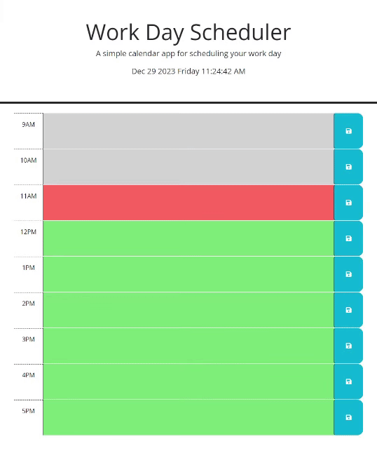

# Work Day Scheduler

## Try it now!
[jman2476.github.io/work_day_scheduler/](https://jman2476.github.io/work_day_scheduler/)

## Description
This application allows the user to save information in different text boxes that correspond to different hours throughout the day. When the user reloads the page, any saved information should remain in the original text box. The text boxes are also color coded by whether it represents a present, past or future hour.

Most importantly, when you hover over the save buttons, the icons spin, and when you hover over the header area the clock at the top spins too.

To make this project, I learned how useful Day.js and jQuery are.

## Usage
Place your mouse over the header. Enjoy the spinning clock.

Place your mouse over a save button. Bask in its spin.

Resign yourself to the fact that you must get work done, and type some text in one of the text boxes, and press the blue botton to the right to save the info in that text box. You must use the save button adjacent to the text box, as using another button will not work. Again, bask in the spin as you click the button.

## Mockup

## License
MIT License

## Tests
To  verify the application is working as intended, here are a few tests you can run:

-- Place your moouse over the header. There should be clock displaying the current date and time, and it should be spinning in a soothing fashion. If the fashion is not soothing, please contact your congressman.

-- Place your cursor over one of the blue bottons. The icon on this button should start spinning, but no other icons should be spinning (unless you have multiple cursors or something). If multiple icons are spinning and you don't have multiple cursors, please contact your congressman speach writer.

## Badges

